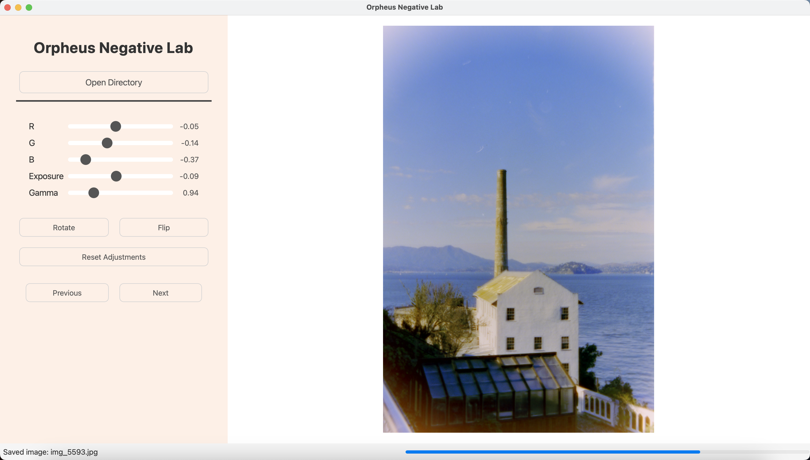
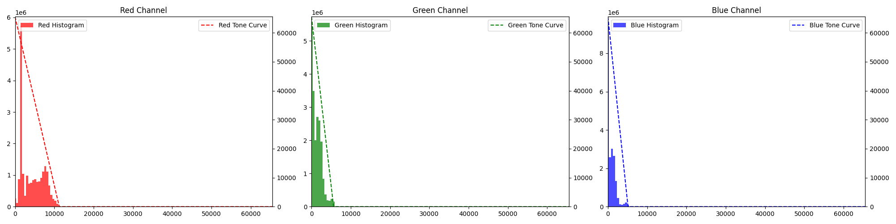
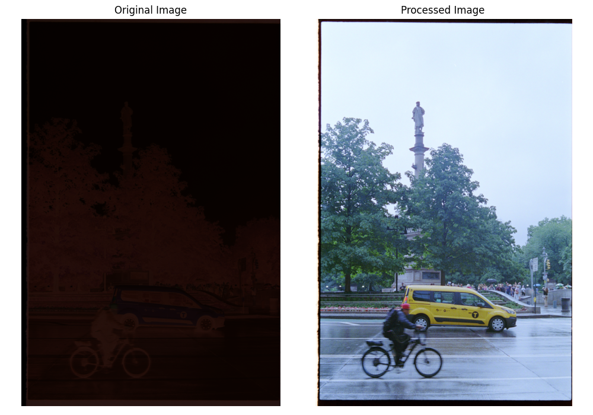

# Orpheus Negative Lab - Process Film Negatives

Convert c41 and B&W negatives into positive images.


## Features

* **RAW File Support:** Loads and processes various RAW file formats (e.g.: .cr2, .cr3, .raw, .nef).
* **Real-time Adjustments:** Interactive sliders for adjusting Red, Green, Blue channels, Exposure, and Gamma.
* **Rotation and Flipping:** Rotate images 90 degrees counter-clockwise and flip (left-right).
* **Image Navigation:** Easily navigate between images in a directory.
* **Saving Processed Images:** Saves the processed images as high-quality JPEGs in a "positives" subdirectory.
* **Modern UI:** Clean and intuitive user interface.
* **Asynchronous Image Loading:** Uses a separate thread to load images, preventing UI freezes. Includes a progress bar in the status bar.
* **Asynchronous Image Saving:** Uses a separate thread to save images, preventing UI freezes.

## Getting Started

This section provides a detailed walkthrough to get you up and running with Orpheus Negative Lab.

### 1. Prerequisites

Before you begin, ensure you have the following installed:

* **Python 3.7+:**  Orpheus Negative Lab is designed to work with Python 3.7 or higher. You can download the latest version from [https://www.python.org/downloads/](https://www.python.org/downloads/).  It's highly recommended to use a recent version of Python 3.
* **Git (Optional but Recommended):** Git is a version control system that makes it easy to download and update the project. If you don't have Git, you can download it from [https://git-scm.com/](https://git-scm.com/).  If you choose not to use Git, you can download the project as a ZIP file.

### 2. Installation

There are two main ways to install Orpheus Negative Lab: using Git (recommended) or downloading a ZIP archive. I highly recommend using a virtual environment. 
#### Method 1: Use the .DMG installer (easiest)
##### Disclaimer: This .dmg is just something I put together for convenience. You'll likely get a security warning that you will have to change security permissions for. Do you own research before you proceed. I bear no responsibility if something goes wrong. 
There is one weird quirk of the app. It crashes the first time you open it. The second time you open it, it'll work fine (although it takes a few seconds to load). I don't know why. That being said, it is still the most convenient to use the app. If you don't want to deal with it, use Method 2 or 3

#### Method 2: Using Git 

1. **Clone the repository:** Open your terminal or command prompt and navigate to the directory where you want to store the project. Then, run the following command:

```bash
git clone https://github.com/parasharmohapatra/orpheusnegativelab.git
```

This will create a folder named OrpheusNegativeLab containing the project files.

2. Navigate to the project directory:

```bash
cd orpheusnegativelab
```

3. Run the following command in your terminal (make sure your virtual environment is active):

```bash
pip install -r requirements.txt
```

This will install all the required libraries.

#### Method 3: Downloading a ZIP Archive

1. Download the ZIP file. Extract the ZIP file: Extract the downloaded ZIP file to the directory where you want to store the project.

2. Navigate to the project directory: Open your terminal or command prompt and navigate to the extracted directory.

3. Install the required packages: Follow step 3 from the Git method above.


#### Running the Application
Once you have installed the dependencies, you can run the application: 

Run the application (after activating your virtual environment if you created one)::

```bash
python app.py
```
This will start Orpheus Negative Lab.

### 3. Using the Software
1. Open a directory: Click the "Open Directory" button and select the directory containing your RAW negatives. .CR2, .CR3 and .nef are supported (more will be added).

2. I've tried to make the default processing done image provide reasonable outputs (this is also a work in progress so I'll try to keep making it better). However, everyone's style is different so here's how you can use the sliders to achieve your desired looks:
 - White balance and tint adjusts blue-yellow and green-magenta respectively
 - Glow slider can be used to adjust contrast (don't ask me why I didn't name this slider contrast)
 - Brightness, Contrast, Highlights and Shadows work similar to what you'd expect. 
 - Gamma and log for more sophisticated tonal adjustments

3. Navigate images: Use the "Previous" and "Next" buttons to move between images in the loaded directory.

4. Rotate and Flip: Use the "Rotate" and "Flip" buttons to transform the current image.

5. Save: Processed images are automatically saved as JPEGs in a "positives" subdirectory within the selected directory when you navigate to the next or previous image.

6. Reset Adjustments: Click the "Reset Adjustments" button to return all the sliders to their default values.

### 4. How Does it Work?

The image processing algorithm is relatively simple. It performs the following computations:

1. Gets the histogram for each color channel
2. Finds the corners of each histogram

3. Applies contrast stretching using the glow slider
4. Applies the brightness, contrast, shadows and highlights adjustments
5. Optional - gamma and log adjustments for finer control




 
