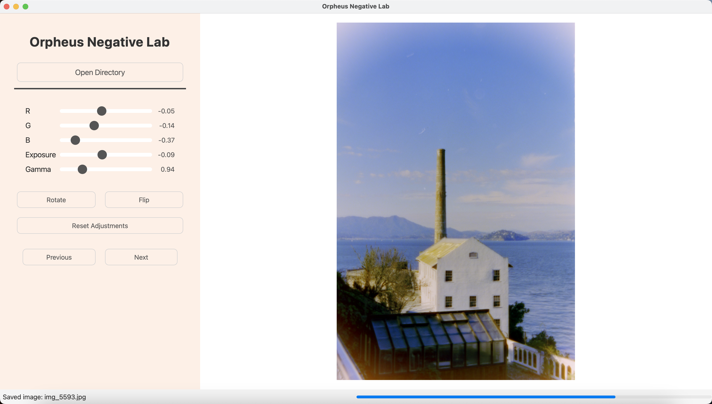

# Orpheus Negative Lab - Process Film Negatives

Convert c41 negatives into positive images. Tries to produce similar results to Lightroom Classic + Negative Lab Pro.


## Features

* **RAW File Support:** Loads and processes various RAW file formats (e.g., .cr2, .cr3, .raw, .nef).
* **Real-time Adjustments:** Interactive sliders for adjusting Red, Green, Blue channels, Exposure, and Gamma.
* **Rotation and Flipping:** Rotate images 90 degrees counter-clockwise and flip (left-right).
* **Image Navigation:** Easily navigate between images in a directory.
* **Saving Processed Images:** Saves the processed images as high-quality JPEGs in a "positives" subdirectory.
* **Modern UI:** Clean and intuitive user interface.
* **Asynchronous Image Loading:** Uses a separate thread to load images, preventing UI freezes. Includes a progress bar in the status bar.
* **Asynchronous Image Saving:** Uses a separate thread to save images, preventing UI freezes.

## Getting Started

This section provides a detailed walkthrough to get you up and running with Orpheus Negative Lab.

### 1. Prerequisites

Before you begin, ensure you have the following installed:

* **Python 3.7+:**  Orpheus Negative Lab is designed to work with Python 3.7 or higher. You can download the latest version from [https://www.python.org/downloads/](https://www.python.org/downloads/).  It's highly recommended to use a recent version of Python 3.
* **Git (Optional but Recommended):** Git is a version control system that makes it easy to download and update the project. If you don't have Git, you can download it from [https://git-scm.com/](https://git-scm.com/).  If you choose not to use Git, you can download the project as a ZIP file.

### 2. Installation

There are two main ways to install Orpheus Negative Lab: using Git (recommended) or downloading a ZIP archive.

#### Method 1: Using Git (Recommended)

1. **Clone the repository:** Open your terminal or command prompt and navigate to the directory where you want to store the project. Then, run the following command:

```bash
git clone https://github.com/parasharmohapatra/orpheusnegativelab.git
```

This will create a folder named OrpheusNegativeLab containing the project files.

2. Navigate to the project directory:

```bash
cd orpheusnegativelab
```

3. Create a virtual environment (highly recommended):  Virtual environments isolate project dependencies and prevent conflicts with other Python projects.

```bash
python3 -m venv .venv        # Creates a virtual environment named ".venv"
```

Activate the virtual environment:

Linux/macOS:

```bash
source .venv/bin/activate
```

Windows:
```bash
.venv\Scripts\activate
```

4. You should see the name of the virtual environment (e.g., .venv) in parentheses at the beginning of your terminal prompt, indicating that it's active.

Install the required packages:  It's essential to install the necessary Python packages.  

Run the following command in your terminal (make sure your virtual environment is active):

```bash
pip install -r requirements.txt
```

This will install all the required libraries.

#### Method 2: Downloading a ZIP Archive

1. Download the ZIP file. Extract the ZIP file: Extract the downloaded ZIP file to the directory where you want to store the project.

2. Navigate to the project directory: Open your terminal or command prompt and navigate to the extracted directory.

3. Create and activate a virtual environment: Follow steps 3 and 4 from the Git method above.

4. Install the required packages: Follow step 5 from the Git method above.


#### Running the Application
Once you have installed the dependencies, you can run the application:

Activate your virtual environment (if you created one):  (See step 4 in the installation instructions.)

Run the application:

```bash
python main.py
```
This will start Orpheus Negative Lab.

### 3. Using the Software
1. Open a directory: Click the "Open Directory" button and select the directory containing your RAW negatives. Make sure these are the correct RAW files your camera uses.

2. I've tried to make the default processing done image provide reasonable outputs (this is also a work in progress so I'll try to keep making it better). However, everyone's style is different so here's how you can use the sliders to achieve your desired looks:
 - Lowering R will make the image more cyan. Increasing it will make it more red.
 - Lowering G will make the image more magenta. Increasing it will make it more green. 
 - Lowering B will make the image more yellow. Increasing it will make it more blue. 
 - Exposure slider increases/decreases the intensity of all the pixels in an image by the same amount. 
 - Gamma slider can be used to adjust contrast. (a bit of an oversimplification of what gamma adjustment does)
I've found most of the time, the RGB values need to change by a bit to get the perfect white balance. Gamma and exposure are typically dependent on personal preference.

3. Navigate images: Use the "Previous" and "Next" buttons to move between images in the loaded directory.

4. Rotate and Flip: Use the "Rotate" and "Flip" buttons to transform the current image.

5. Save: Processed images are automatically saved as JPEGs in a "positives" subdirectory within the selected directory when you navigate to the next or previous image.

6. Reset Adjustments: Click the "Reset Adjustments" button to return all the sliders to their default values.
