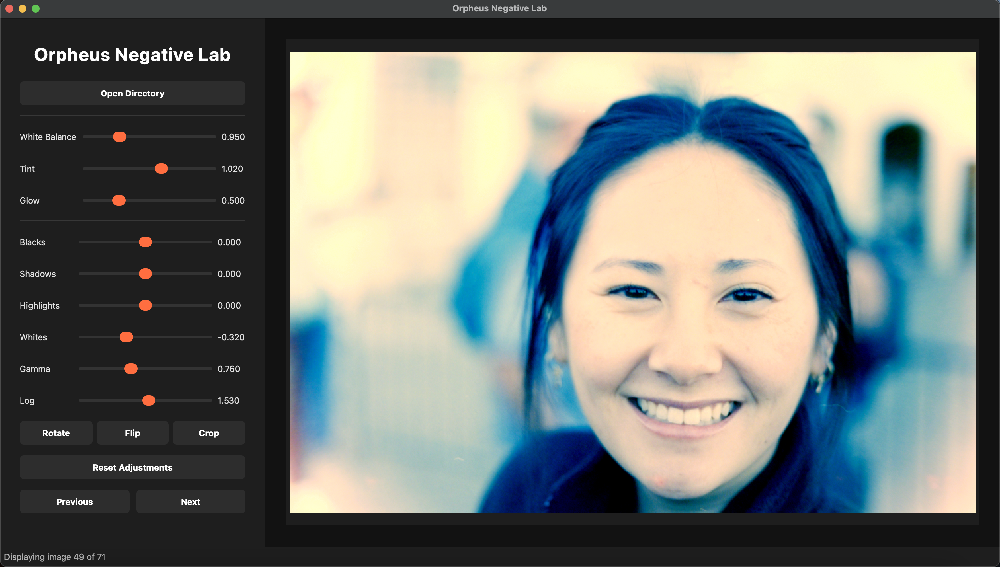

# Orpheus Negative Lab

A desktop application for converting color (C41) and black & white film negatives into positive images using advanced, interactive tone curve editing.



## Features

- **RAW Image Support:** Load and process RAW files from most cameras (e.g., .cr2, .cr3, .nef, .raw).
- **Triangle-Based Tone Curves:** Adjust red, green, and blue channels independently using unique triangle-based tone curves for fine color correction.
- **Exposure & Contrast:** Real-time sliders for exposure and contrast adjustments.
- **Image Transformations:** Rotate and flip images for proper orientation.
- **Batch Processing:** Process all images in a directory with your chosen settings.
- **Modern UI:** Clean, intuitive PyQt5 interface with real-time histogram and tone curve visualization.
- **Image Navigation:** Quickly move between images in a folder.
- **Save Processed Images:** Export high-quality JPEGs with a single click.

## Getting Started

### 1. Prerequisites

- **Python 3.7+**
- **pip** (Python package manager)
- **Recommended:** Use a virtual environment (e.g., `venv` or `conda`).

### 2. Installation

Clone the repository and install dependencies:

```bash
git clone https://github.com/parasharmohapatra/orpheusnegativelab.git
cd orpheusnegativelab
pip install -r requirements.txt
```

### 3. Running Orpheus Negative Lab

Run the application with:

```bash
python orpheus.py
```

### 4. Usage

1. **Open a Directory:** Click "Open Directory" and select a folder containing your RAW film negatives.
2. **Navigate Images:** Use "Previous" and "Next" to browse through your images.
3. **Adjust Tone Curves:** Use the RGB sliders to fine-tune each channel's tone curve. Adjust exposure and contrast as needed. Changes are reflected in real time.
4. **Visualize:** View histograms and tone curves for each channel to guide your edits.
5. **Transform:** Rotate or flip images for correct orientation.
6. **Save:** Save the processed image as a JPEG in a "positives" subdirectory.
7. **Batch Process:** Process all images in the directory using your current settings.
8. **Reset:** Return all sliders and transformations to default values with the reset option.

### 5. How It Works

- The app inverts the RAW negative and analyzes each color channel's histogram.
- Triangle-based tone curves are generated for each channel, allowing precise highlight, shadow, and midtone control.
- Exposure and contrast adjustments are applied in real time.
- All edits are non-destructive; originals are never overwritten.


## Troubleshooting

- If you encounter issues with RAW file support, ensure you have `rawpy` and `opencv-python` installed.
- For UI issues, check your PyQt5 installation.
- For best results, use high-quality RAW scans of your negatives.

## License

This project is provided as-is for personal and educational use. See LICENSE for details.

---

For questions, feature requests, or contributions, please open an issue or pull request on GitHub.
